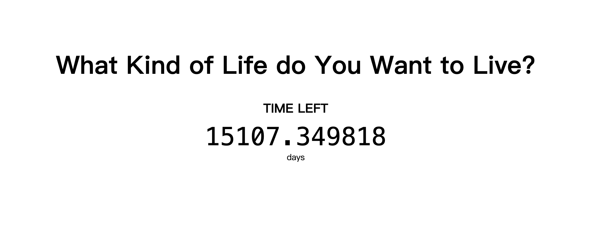

# What kind of life do you want to live

This extension will show a countdown of your life expectancy base on [Actuarial Life Table](https://www.ssa.gov/oact/STATS/table4c6.html)。



This extension inspired by [Death Focus](https://chrome.google.com/webstore/detail/aanjfkjcndemihgneohhjicnaahlphbm), and the name is from Hayao Miyazaki's movie.

Life is short, you should cherish every minute and every second. Go out and have fun, take a walk, learn something new, cook a delicious meal, and work hard to create a better life for your family. Don't waste your time on meaningless things.

Ask yourself: What kind of life do you want to live?

## Development

```bash
# Start development server with hot reload
yarn dev

# The dev server will run at http://localhost:3000
# Changes to source files will automatically reload the browser
```

## Build for Production

```bash
# Build and package the extension
yarn build

# This will create:
# - build/ directory with compiled files
# - extension.zip ready to upload to Chrome Web Store
```
